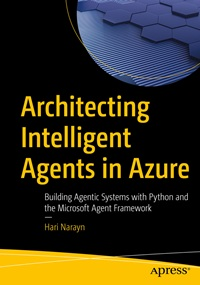

# Architecting Intelligent Agents in Azure

This repository accompanies [*Architecting Intelligent Agents in Azure: Building Agentic Systems with Python and the Microsoft Agent Framework*](https://link.springer.com/book/9798868824326) by Hari Narayn (Apress, 2026).

[comment]: #cover


The book follows one system, Thain, as it grows from a simple support-triage agent into a governed, observable, multi-agent service on Azure. This repository contains the chapter code, Microsoft Agent Framework 1.5.0 General Availability (GA) companion code, migration notes, and architecture notes.

## Repository Structure

```text
Chapter 2/ ... Chapter 10/   Original code matching the book listings
Code GA/                     Microsoft Agent Framework 1.5.0 GA code
Migration Notes/             Chapter-by-chapter beta-to-GA migration notes
Architectural Notes/         Chapter-level architecture notes and modern capability mapping
```

Chapter 1 is conceptual and does not include code. Each later chapter represents a validated system boundary, so you can start from the folder for the chapter you are reading.

## Which Code Should I Use?

Use the `Code GA/` folder for the current runnable implementation. The original `Chapter N/` folders are preserved to match the printed listings and learning flow in the book.

The GA code keeps the same architecture and behavior while using Microsoft Agent Framework 1.5.0 APIs. The migration notes explain the API changes chapter by chapter.

## Getting Started

Clone the repository:

```bash
git clone https://github.com/Apress/Architecting-Intelligent-Agents-in-Azure.git
cd Architecting-Intelligent-Agents-in-Azure
```

Then open the chapter folder you want to run. For example:

```bash
cd "Code GA/Chapter 2/thain"
python -m venv .venv
.\.venv\Scripts\activate
pip install -r requirements.txt
```

Some chapters require Azure resources such as Azure OpenAI, Cosmos DB, Azure AI Search, Application Insights, Azure Container Apps, or Microsoft Foundry. See the relevant chapter and its README before running the code.

Sanitized `.env` and `.env.dev` templates are included where needed. Replace placeholder or blank values with your own Azure settings before running deployed examples.

## Notes for Readers

DevUI is used in the book as a learning aid to make agent behavior, tool calls, and traces visible during development. Treat it as a development companion, not a production interface.

The `Architectural Notes/` folder adds production-oriented commentary for each chapter, including where newer Microsoft Agent Framework capabilities such as workflows, middleware, checkpointing, evaluation, hosted agents, skills, MCP, and A2A can be explored.

## Contributions

See [Contributing.md](Contributing.md) for more information on how you can contribute to this repository. If you find a setup issue, code correction, or compatibility problem, please raise a GitHub issue.
